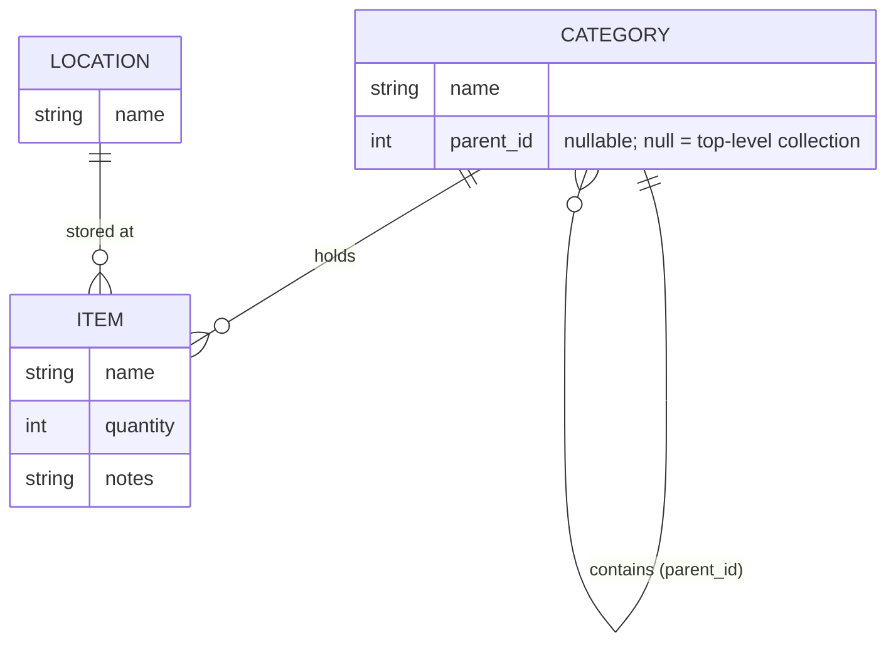
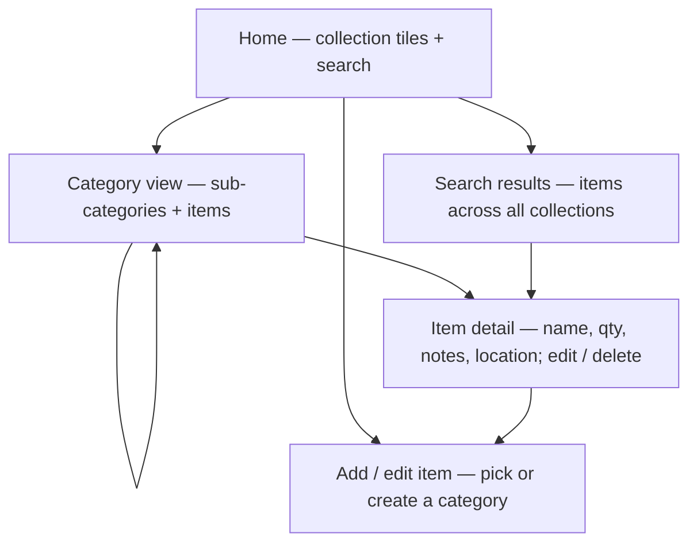
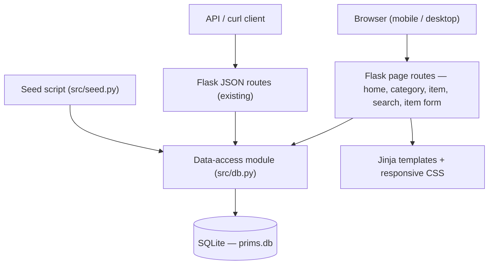

# PRIMS Web Interface & Seed Data - Plan

## Goal Capsule

- **Objective:** Give PRIMS a browsable, searchable, mobile-friendly web interface for the owner's personal inventory, and seed it with realistic nested entries across Kitchen, Library, and Records.
- **Product authority:** The repository owner (single user, cataloging their own belongings).
- **Execution profile:** Standard code implementation on the existing Flask + SQLite app. Server-rendered pages; no separate frontend build.
- **Stop conditions:** If `prims.db` is found to hold real (non-test) data the owner wants to keep, stop before recreating it (KTD4 assumes it is disposable) and confirm a migration path.
- **Tail ownership:** A standalone `ce-work` run owns commits and local verification. No deployment — the app runs locally.

---

## Product Contract

**Preservation note:** Product Contract meaning and R/KD/F/AE IDs unchanged from the requirements-only version. The three "Deferred to Planning" questions are now resolved — see KTD1 (web stack), KTD3 (category uniqueness), and U6 (seed content/volume).

### Summary

Add a web interface to PRIMS that lets the owner browse their belongings through a nestable category tree, search across everything from one box, and add, edit, and delete items — all usable from a phone. Ship it with seed data across Kitchen, Library, and Records. Every item records the same simple fields: name, quantity, and freeform notes.

### Problem Frame

PRIMS today is an API-only Flask backend (`src/app.py`): it exposes CRUD endpoints for inventory, categories, and locations, but there is no way to actually *use* it day to day. Answering "how many pint glasses should I have?" or "do I already own this book?" means hand-crafting HTTP requests — so the tool that is supposed to track a home's belongings can't be opened at a bookstore or a kitchen cupboard. The gap is a usable front door: browsing, searching, and adding from a normal screen, especially a phone. Search and a web interface are both currently unchecked items on the project's own roadmap (`README.md`).

### Key Decisions

- KD1. **Uniform item fields over per-type columns.** (session-settled: user-directed — chosen over structured per-type fields: keeps the catalog simple and fast; a book's author or a record's artist lives in searchable notes, trading away sort-by-attribute.) Governs R1.
- KD2. **Unlimited category nesting, with items allowed at any level.** (session-settled: user-directed — chosen over fixed two-level nesting and over leaf-only placement: matches a "drop it in now, refine later" habit.) Governs R2, R3.
- KD3. **Locations stay a flat label, not a nested tree.** (session-settled: user-approved — surfaced and accepted: nested locations weren't needed for the target scenarios.) Governs R4.
- KD4. **Single-user, local app for this version.** (session-settled: user-approved — accounts and deployment deferred; the target user is the owner cataloging their own things.) See Scope Boundaries.
- KD5. **Full item add/edit/delete in v1; category-tree reorganization UI deferred.** (session-settled: user-approved — chosen over view-and-add-only and over full tree management: covers correcting a count and removing what's gone, without fiddly on-phone tree editing.) Governs R10, R11, R12.

### Data Model

The web interface rests on a small data shape that extends what `src/app.py` already has. Categories become a self-referencing tree; items gain a notes field; locations stay flat.

- A **category** may point to a parent category (its `parent_id`); a category with no parent is a top-level collection (Kitchen, Library, Records). Depth is unlimited.
- An **item** attaches to exactly one category — which may sit at any depth — and optionally to one location.
- A **location** is a flat label ("cupboard", "bookshelf").

### Requirements

**Data model & seed data**

- R1. Every item records the same fields: a name, a quantity, and an optional freeform notes field — regardless of what kind of thing it is. Per KD1.
- R2. Items are organized in a category tree of unlimited depth; a category may contain sub-categories, items, or both. Top-level categories are the owner's collections. Per KD2.
- R3. An item may attach to a category at any level of the tree, not only to bottom-level categories. Per KD2.
- R4. An item may record one location (where it is kept); locations are a flat set of labels, not nested. Per KD3.
- R5. PRIMS is seeded with realistic mock entries across three collections — Kitchen (with nested sub-types such as glassware, appliances, and dishes), Library (books), and Records — so the interface is populated on first open.

**Browse & find**

- R6. The home screen presents the top-level collections as tiles the owner taps to enter, and makes search reachable from the home screen.
- R7. Opening a category shows its sub-categories and any items attached directly to it.
- R8. A single search finds items across all collections, matching on both name and notes.
- R9. The interface is usable on a phone — layout and interactions work at small screen sizes, since checking inventory while out is a primary use.

**Manage items**

- R10. The owner can add a new item, choosing an existing category or creating one inline, and setting name, quantity, notes, and location. Per KD5.
- R11. The owner can edit an existing item, including adjusting its quantity. Per KD5.
- R12. The owner can delete an item. Per KD5.

### Navigation Shape

### Key Flows

- F1. **Confirm a quantity.**
  - **Trigger:** The owner suspects a count is off ("did I toss a pint glass?").
  - **Steps:** Open PRIMS; reach the item by browsing Kitchen → Glassware or by searching; read the quantity; optionally edit it to match reality.
  - **Covers:** R6, R7, R8, R11.
- F2. **Duplicate check while out.**
  - **Trigger:** At a bookstore, unsure whether a title is already owned.
  - **Steps:** Open PRIMS on a phone; search the title; see whether it exists in the Library.
  - **Covers:** R8, R9.
- F3. **Add after shopping.**
  - **Trigger:** New books, records, or kitchen items just acquired.
  - **Steps:** Open PRIMS; add an item; pick or create its category; set name, quantity, notes, location; save; repeat.
  - **Covers:** R5, R10.

### Acceptance Examples

- AE1. **Covers R7.** Given Kitchen holds sub-categories (Glassware, Appliances) and a loose item (spare sponges) attached directly to Kitchen, When the owner opens Kitchen, Then both the sub-categories and the loose item are shown together.
- AE2. **Covers R8.** Given a record named "Kind of Blue" whose notes read "Miles Davis, 1959", When the owner searches "Miles", Then the record appears in results.
- AE3. **Covers R11.** Given a pint-glass item with quantity 6, When the owner edits the quantity to 5, Then the item afterward shows 5.
- AE4. **Covers R3, R10.** Given the owner is adding a book but has not chosen a sub-type, When they attach it directly to Library, Then the item is saved under Library at the top level.

### Scope Boundaries

- Accounts, login, and any multi-user behavior — deferred; this version is single-user and local.
- Deployment / hosting — deferred; runs locally for now.
- A dedicated screen to rename, move, or reorganize the category tree — deferred; v1 creates categories inline during item add (per KD5).
- Structured, sortable per-type attributes (e.g., "all records sorted by artist") — out of scope by KD1; such detail lives in freeform notes and is reachable by search, not sort.
- The existing file upload/download feature in `src/app.py` — left in place, untouched.

#### Deferred to Follow-Up Work

- Category management screen (rename / move / delete branches of the tree).
- Location management UI beyond attaching a label during item add/edit.

### Dependencies / Assumptions

- Builds on the existing Flask + SQLite backend; the data-model changes extend the current `inventory`, `categories`, and `locations` tables.
- Assumes `prims.db` currently holds only disposable test data (KTD4). If real data exists, the Goal Capsule stop condition applies.

---

## Planning Contract

### Key Technical Decisions

- KTD1. **Server-rendered pages with Flask's Jinja templating, a small responsive stylesheet, and minimal JavaScript.** (session-settled: user-approved — chosen over a separate JavaScript frontend: least added machinery, one process to run, fits a single-user app.) Governs R6, R7, R8, R9, R10, R11, R12.
- KTD2. **Nested categories as an adjacency list — each category row carries a nullable `parent_id` referencing `categories.id`.** Implements KD2 (Governs R2, R3). Subtree and browse queries use SQLite recursive CTEs; a `NULL` parent marks a top-level collection.
- KTD3. **Category names are unique within a parent, not globally.** (session-settled: user-approved — chosen over keeping the current global unique constraint: nesting means "Glassware" can legitimately recur under different collections.) Governs R2. Replaces the current `categories.name UNIQUE` with a `UNIQUE(parent_id, name)` constraint.
- KTD4. **Evolve the schema in `init_db` and rebuild `prims.db` via the seed script — no migration framework.** (session-settled: user-approved — chosen over a migration tool: the DB is git-ignored disposable test data for a single-user app.) Adds `categories.parent_id` and `inventory.notes`.
- KTD5. **Keep the existing JSON API endpoints working; add HTML page routes alongside, both sharing one data-access module.** (session-settled: user-approved — chosen over replacing the API: the endpoints already work and are exercised by `tests/test_crud_operations.sh`.) Governs R6–R12 delivery path.
- KTD6. **Introduce `pytest` for automated tests; keep the legacy curl smoke script.** The repo has no test framework today; feature-bearing units need real assertions the curl script can't provide.

### High-Level Technical Design

One Flask app serves both the existing JSON API and the new HTML pages. A new data-access module centralizes SQLite reads/writes (returning dict-shaped rows) so pages, API, and the seed script share one implementation.

### Assumptions

- The app is launched locally (`python src/app.py`); templates and static assets resolve from `src/`.
- Deleting a category with children or attached items is a defined edge case resolved in U2 (default: block deletion while non-empty), not left to the implementer.

### Sequencing

U1 → U2 → U3 → (U4, U5) → U6. U4 and U5 both depend on U2 and U3; U6 depends on U2. Seed (U6) is verified last because it exercises the full data layer.

---

## Implementation Units

### U1. Dependencies and template/static scaffolding

- **Goal:** Make the app runnable with pinned dependencies and wire Flask to serve Jinja templates and static assets.
- **Requirements:** Prerequisite for R6–R12. Per KTD1, KTD6.
- **Dependencies:** none.
- **Files:** `requirements.txt` (new), `src/app.py` (modify), `src/templates/base.html` (new), `src/static/style.css` (new).
- **Approach:**
  1. Add `requirements.txt` pinning `flask`, `werkzeug`, and `pytest`.
  2. Confirm the Flask app resolves `src/templates/` and `src/static/` (set `template_folder`/`static_folder` if the run context needs it).
  3. Add `base.html` with a responsive viewport meta tag, a header holding the app name and a search box, and a stylesheet link.
- **Execution note:** Mostly packaging and scaffolding; prefer an install-and-boot smoke check over unit tests.
- **Patterns to follow:** Existing app construction in `src/app.py`.
- **Test scenarios:**
  - Test expectation: smoke only — `pip install -r requirements.txt` succeeds and `python src/app.py` boots and serves a page at `/` without error.
- **Verification:** App starts; the home route returns an HTML page (even if minimal) rather than the old plain-text string.

### U2. Schema evolution and data-access module

- **Goal:** Evolve the SQLite schema for nesting and notes, and centralize all DB access into one module returning dict-shaped rows.
- **Requirements:** R1, R2, R3, R4. Per KTD2, KTD3, KTD4.
- **Dependencies:** U1.
- **Files:** `src/db.py` (new), `src/app.py` (modify `init_db` and refactor existing endpoints to use `src/db.py`), `tests/test_db.py` (new).
- **Approach:**
  1. In `init_db`, add `parent_id` (nullable FK to `categories.id`) to `categories`, replace `categories.name UNIQUE` with `UNIQUE(parent_id, name)` per KTD3, and add `notes TEXT` to `inventory`.
  2. Add data-access helpers: create/read/update/delete for items, categories (with parent), and locations; a helper returning a category's direct sub-categories and directly-attached items (per R7); and a recursive-CTE helper for subtree/search scope (per KTD2).
  3. Return rows as dicts with named fields so templates and the JSON API stop emitting raw tuples.
  4. Define delete-with-children behavior: block deleting a non-empty category (has sub-categories or items).
- **Patterns to follow:** Existing `sqlite3` usage and table creation in `src/app.py`.
- **Test scenarios:**
  - Creating a category with a `parent_id` nests it under that parent. Covers R2.
  - Two categories with the same name under different parents both succeed; the same name under the same parent is rejected. Covers R2 (KTD3).
  - An item created with a top-level category id attaches directly to that collection. Covers R3 / AE4.
  - An item saved with notes returns those notes when read back. Covers R1.
  - Fetching a category returns both its sub-categories and its directly-attached items. Covers R7 / AE1.
  - The subtree helper returns nested descendants of a category, not just direct children.
  - Deleting a non-empty category is blocked; deleting an empty one succeeds.
- **Verification:** A fresh `prims.db` created by `init_db` has the new columns and constraint; `tests/test_db.py` passes.

### U3. Browse pages — home, category, item detail

- **Goal:** Server-rendered pages to browse collections, drill into categories, and view an item.
- **Requirements:** R6, R7, R9. F1. AE1. Per KTD1, KTD5.
- **Dependencies:** U2.
- **Files:** `src/app.py` (page routes `/`, `/category/<int:id>`, `/item/<int:id>`), `src/templates/home.html`, `src/templates/category.html`, `src/templates/item.html` (new), `src/static/style.css` (extend), `tests/test_pages.py` (new).
- **Approach:**
  1. `GET /` renders top-level collections as tiles, each with an item count; header exposes search.
  2. `GET /category/<id>` renders the category's sub-categories and directly-attached items using the U2 helper.
  3. `GET /item/<id>` renders name, quantity, notes, and location, with edit/delete affordances (wired in U5).
  4. Responsive layout so tiles and lists work at phone width (R9).
- **Patterns to follow:** U2 data-access helpers; `base.html` from U1.
- **Test scenarios:**
  - `GET /` lists the top-level collections as tiles. Covers R6.
  - Opening a category shows both its sub-categories and its directly-attached items. Covers R7 / AE1.
  - Item detail shows name, quantity, notes, and location.
  - A category with only sub-categories renders with no items section; a category with only items renders with no sub-category section.
  - An unknown category or item id returns 404.
- **Verification:** With seed data present, the three pages render and drilling from home to an item works at a mobile viewport width.

### U4. Search across all items

- **Goal:** One search box that finds items across every collection by name and notes.
- **Requirements:** R8, R9. F2. AE2.
- **Dependencies:** U2, U3.
- **Files:** `src/app.py` (`GET /search`), `src/db.py` (search helper), `src/templates/search.html` (new), `tests/test_search.py` (new).
- **Approach:**
  1. `GET /search?q=` matches `q` against item name and notes, case-insensitive, across all categories.
  2. Results link to item detail; the search box lives in the shared header (reachable from every page).
- **Patterns to follow:** U2 data-access helpers; header search box from U1/U3.
- **Test scenarios:**
  - Searching a substring of an item name returns that item. Covers R8.
  - Searching a term present only in notes returns the item ("Miles" finds "Kind of Blue"). Covers R8 / AE2.
  - Search is case-insensitive.
  - A query with no matches renders a clear "no results" state.
  - An empty query renders a prompt/empty state rather than erroring.
- **Verification:** The bookstore duplicate-check flow (F2) works from a phone-width screen.

### U5. Add, edit, and delete items

- **Goal:** Forms to add an item (creating a category inline), edit an item including its quantity, and delete an item.
- **Requirements:** R9, R10, R11, R12. F1, F3. AE3, AE4. Per KTD5.
- **Dependencies:** U2, U3.
- **Files:** `src/app.py` (routes `GET/POST /item/new`, `GET/POST /item/<id>/edit`, `POST /item/<id>/delete`), `src/db.py` (inline category-create helper), `src/templates/item_form.html` (new), `tests/test_item_crud.py` (new).
- **Approach:**
  1. Add form collects name, quantity, notes, location, and category — the category is either chosen from the existing tree or created inline by naming it under a chosen parent.
  2. Edit form prefills the item's fields and allows changing any, including quantity.
  3. Delete removes the item via a POST (guarded by a confirmation in the UI).
- **Patterns to follow:** U2 data-access helpers; existing JSON create/update/delete logic in `src/app.py` as reference behavior.
- **Test scenarios:**
  - Adding an item with an existing category persists it and it appears under that category. Covers R10.
  - Adding an item while creating a new category inline creates both the category and the item. Covers R10.
  - Adding a book attached directly to Library (top level) saves it there. Covers R3 / AE4.
  - Editing an item's quantity from 6 to 5 persists 5. Covers R11 / AE3.
  - Deleting an item removes it; it no longer appears in browse or search. Covers R12.
  - Submitting the add form with no name returns a validation error, not a crash.
  - Editing or deleting an unknown item id returns 404.
- **Verification:** A full add → edit-quantity → delete loop works end to end through the web pages.

### U6. Seed data script

- **Goal:** A runnable script that populates a realistic nested tree across Kitchen, Library, and Records.
- **Requirements:** R5.
- **Dependencies:** U2.
- **Files:** `src/seed.py` (new), `tests/test_seed.py` (new).
- **Approach:**
  1. Rebuild the schema (per KTD4) and insert the three top-level collections.
  2. Nest sub-types under Kitchen (Glassware, Appliances, Dishes) with items (e.g., pint glass, blender), plus at least one item attached directly to Kitchen (supports AE1).
  3. Populate Library with books (author captured in notes) and Records with albums (artist/year in notes, e.g., "Kind of Blue" / "Miles Davis, 1959" for AE2).
  4. Target roughly a dozen-plus items per collection; provide a documented run command.
- **Patterns to follow:** U2 data-access helpers only — the seed script must not hand-write SQL that bypasses the data layer.
- **Test scenarios:**
  - Running the seed populates all three collections with nested categories and items. Covers R5.
  - The seed creates at least one item attached directly to a top-level collection. Supports AE1.
  - The seed creates a record whose notes contain an artist name searchable by U4. Supports AE2.
- **Verification:** After `python src/seed.py`, the home page shows three collections with non-zero counts and the AE1/AE2 scenarios reproduce.

---

## Verification Contract

| Gate | Command / action | Applies to |
|---|---|---|
| Automated tests | `python -m pytest tests/` | U2, U3, U4, U5, U6 |
| App boots | `python src/app.py`, then open `/` | U1, U3 |
| Seed populates | `python src/seed.py`, then reload `/` | U6 |
| Mobile check | Load `/`, a category, search, and add/edit/delete at a phone-width viewport | U3, U4, U5 |
| API still works | Run `tests/test_crud_operations.sh` against the running app | U2, U5 (KTD5) |

The three Key Flows (F1 confirm-a-quantity, F2 duplicate-check, F3 add-after-shopping) are the end-to-end acceptance signals; each must be walkable in the running app on a phone-width screen.

---

## Definition of Done

**Global:**

- All Requirements R1–R12 are satisfied and their Acceptance Examples (AE1–AE4) pass.
- `python -m pytest tests/` is green.
- The app boots and serves the browse, search, and add/edit/delete pages; seed data loads and the three collections show non-zero counts.
- The existing JSON API endpoints and file-management endpoints still function (KTD5).
- `requirements.txt` exists and installs the app cleanly.
- No dead-end or experimental code from abandoned approaches remains in the diff.

**Per unit:** Each U-ID's Test Scenarios and Verification are met before the unit is considered complete.
